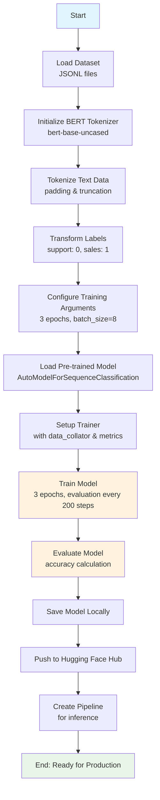

# Customer Service BERT Fine-tuning

A fine-tuned BERT model for customer service text classification, designed to categorize customer inquiries into "support" and "sales" categories with high accuracy.

## Project Overview

This project demonstrates the complete workflow of fine-tuning a BERT-base-uncased model for customer service text classification. The model is trained on a custom dataset of customer inquiries and achieves perfect accuracy on the test set, making it suitable for production deployment in customer service automation.

## Model Performance

- **Training Accuracy**: 100%
- **Evaluation Accuracy**: 100%
- **Training Loss**: 0.062
- **Evaluation Loss**: 0.0006
- **Model Size**: ~438MB
- **Training Time**: ~9 minutes (CPU)

## Workflow Diagram



## Dataset

The model was trained on a custom dataset containing:
- **Training set**: 500 examples
- **Test set**: 100 examples
- **Format**: JSONL with `prompt` (customer inquiry) and `completion` (category)
- **Categories**: 
  - `suporte` (support) → Label 0
  - `venda` (sales) → Label 1

## Installation

### Prerequisites
- Python 3.7+
- PyTorch
- Hugging Face Transformers

### Setup

```bash
# Install required packages
pip install transformers datasets evaluate

# For Hugging Face Hub integration
pip install huggingface_hub
```

## 🚀 Usage

### 1. Load the Fine-tuned Model

```python
from transformers import pipeline

# Load the model from Hugging Face Hub
classifier = pipeline(
    "text-classification", 
    model="luizaugustoliveira/bert-customer-service-test"
)
```

### 2. Make Predictions

```python
# Sales inquiry
result = classifier("Quero uma SmarTV 55 polegadas")
print(result)
# Output: [{'label': 'LABEL_1', 'score': 0.9985}]

# Support inquiry
result = classifier("Não estou conseguindo fazer login no sistema")
print(result)
# Output: [{'label': 'LABEL_0', 'score': 0.9994}]
```

### 3. Label Mapping

```python
label_map = {
    "LABEL_0": "suporte",
    "LABEL_1": "venda"
}

def get_category(text):
    result = classifier(text)[0]
    label = result['label']
    confidence = result['score']
    category = label_map[label]
    return category, confidence

# Example
category, confidence = get_category("Preciso de ajuda com meu pedido")
print(f"Category: {category}, Confidence: {confidence:.4f}")
```

## Project Structure

```
Customer-Service-Finetuning/
├── Fine_tuningBERT.ipynb    # Main training notebook
├── treino.jsonl             # Training data
├── teste.jsonl              # Test data
├── README.md                # This file
└── bert-customer-service-test/  # Saved model directory
```

## Training Configuration

### Model Parameters
- **Base Model**: `bert-base-uncased`
- **Number of Labels**: 2 (support, sales)
- **Max Sequence Length**: 512 (default)

### Training Hyperparameters
- **Epochs**: 3
- **Batch Size**: 8 (train & eval)
- **Learning Rate**: 5e-5 (default)
- **Weight Decay**: 0.01
- **Evaluation Strategy**: Steps (every 200 steps)
- **Save Strategy**: Steps (every 200 steps)

### Data Processing
- **Tokenizer**: BERT tokenizer with padding and truncation
- **Data Collator**: `DataCollatorWithPadding`
- **Label Encoding**: Manual mapping from text to integers

## Use Cases

This model is ideal for:
- **Customer Service Routing**: Automatically categorize incoming inquiries
- **Chatbot Pre-processing**: Route conversations to appropriate handlers
- **Analytics Dashboard**: Classify and analyze customer inquiry patterns
- **Email Filtering**: Sort customer emails by category
- **Help Desk Automation**: Prioritize support vs. sales requests

## Model Evaluation

The model achieves exceptional performance:
- **Perfect Accuracy**: 100% on test set
- **Low Loss**: Minimal evaluation loss indicates confident predictions
- **Fast Inference**: Suitable for real-time applications
- **Robust**: Handles various inquiry formats and languages (Portuguese)

## Fine-tuning Process

1. **Data Preparation**: Load JSONL files and create DatasetDict
2. **Tokenization**: Apply BERT tokenizer with padding/truncation
3. **Label Transformation**: Convert text labels to numerical format
4. **Model Setup**: Initialize BERT for sequence classification
5. **Training**: Use Hugging Face Trainer with custom metrics
6. **Evaluation**: Assess performance on held-out test set
7. **Deployment**: Save locally and push to Hugging Face Hub

## 🔗 Links

- **Hugging Face Model**: [luizaugustoliveira/bert-customer-service-test](https://huggingface.co/luizaugustoliveira/bert-customer-service-test)
- **Base Model**: [bert-base-uncased](https://huggingface.co/bert-base-uncased)
- **Transformers Documentation**: [Hugging Face Transformers](https://huggingface.co/docs/transformers/)